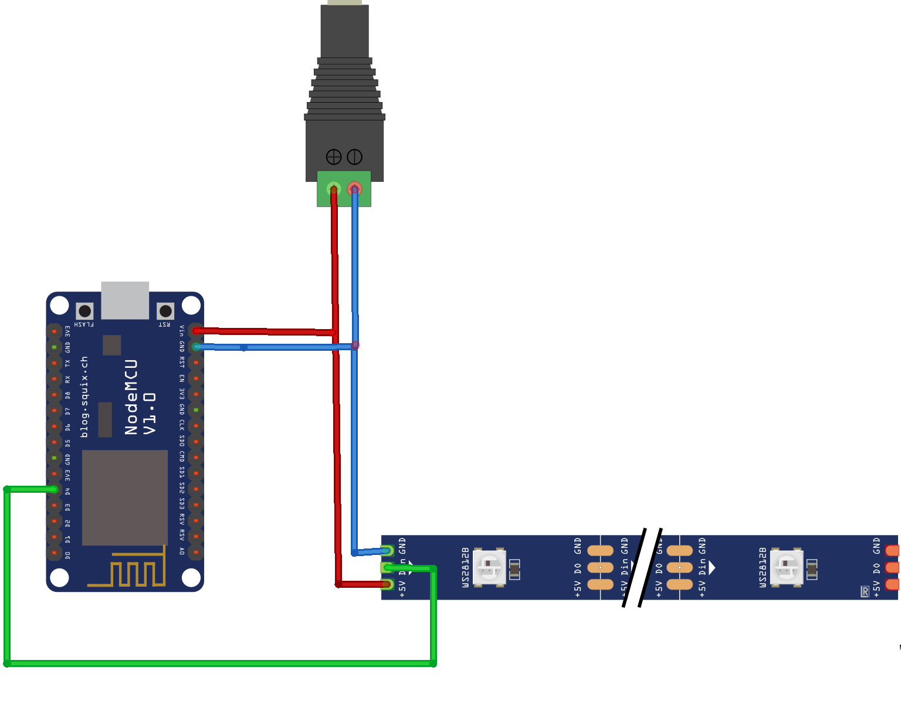

# LEDeffects


<pre>📜List of modes:
2 smooth change of colours for the entire ribbon. 🌈
3 a spinning rainbow. 🌪️🌈
4 random colour change. 🎨
5 running LED 🏃‍♂️💡
6 a running train of LEDs. 🚂💡
7 red and blue rotating. 🔴🔵🔄
8 rotating half red and half blue 🔴🔵🔄
9 random strobe light. ⚡🌈
10 single colour pulsation 💥🌈
11 colour changing pulsation 🌈💥🌈
12 smooth vertical brightness change (for ring) 🔆🔼🔽
13 red LED madness. 🔴💡💥
14 random colour madness. 🎨💥
15 white blue red running in a circle 🏃‍♂️🔵⚪🔴🔄
16 radiation icon pulsating ☢️💥🌈
17 red LED running in a circle 🏃‍♂️🔴🔄
18 white and blue gradient. ⚪🔵🌈
19 same thing's going on. ⏭️🔄
20 red flashes going down 🔴⬇️💥
21 crescent moon. 🌙
22 flame effect. 🔥🔥🔥
23 rainbow in the vertical plane. 🌈🔼🔽
24 Pac-Man. 🎮😄
25 random flash madness. 💥💥💥
26 police flasher. 🚨🔵🔴
27 RGB propeller. 🔄🔴🔵⚪
28 random red flashes in the vertical plane. 🔴💥🔼🔽
29 greens running around randomly. 🟢🏃‍♂️🔄
30 greens running around randomly. 🟢🏃‍♂️🔄
31 something's broken ❌🔧
32 something's broken. ❌🔧
33 smooth colour fills 🎨🔆
34 running LEDs. 🏃‍♂️💡
35 line lights. 🚦💡
36 running circle sectors (doesn't work) 🔴🟢🔵🔄
37 very smooth rotating rainbows. 🌈🔄🌈
38 random multi-coloured lights (1 - all dancing, 0 - random 1 diode) 🎨💃🔴🔵🟢🌈
39 running lights. 🏃‍♂️💡
40 random flashes of white 💥⚪
41 random flashes of white on a white background 💥⚪🔳
42 running every 3 times. 🏃‍♂️🔄⏰
43 running every 3 rainbows. 🏃‍♂️🔄🌈⏰
44 strobe lights. ⚡💡💥
45 bouncing balls. 🏀⬆️⬇️
46 colored bouncing balls. 🎨🏀⬆️⬇️
888 long demo. 🎉🎮
889 short demo. 🎉🎮
999 pause. ⏸️
</pre>

# First steps🐾
<h4>🔸Assemble according to the above scheme</h4>


<h4>🔸<a href="https://github.com/astrosander/LEDeffects/archive/refs/heads/main.zip">Download</a> repository</h4>

<h4>🔸Unarchive</h4>

<h4>🔸Open <a href="https://github.com/astrosander/LEDeffects/blob/main/MAIN/MAIN.ino">./MAIN/MAIN.ino</a></h4>

🔸Edit ```8-11``` lines:
<pre>
8 - Enter Your WiFi login

9 - Enter Your WiFi password

10 - Enter Bot's Token, which You got with
<a href="https://github.com/astrosander/LEDeffects/edit/main/README.md#how-to-make-telegram-bot">@BotFather</a>

11 - Enter Telegram ID, which You got with <a href="https://github.com/astrosander/LEDeffects/edit/main/README.md#how-to-get-my-id">@IDBot</a>
</pre> 
  
<h4>🔸Upload code to Your board</h4>

🔸Go to Your bot and send 
```/start```

🔸To turn on/off press and hold ```Flash button```

# How to make telegram-bot  

1. You must have telegram
2. Go to <a href="https://t.me/BotFather">@BotFather</a>
3. Send ```/newbot```
4. Then, send name You woud like to choose(Ex.: ```AstroHelper```)
5. Send send *username*(Ex.: ```astrohelper_bot```)
6. All right, You just created Your own bot!

# How to get my id  

1. You must have telegram
2. Go to <a href="https://t.me/myidbot">@IDBot</a>
3. Send ```/getid```
4. Copy Your id!

##  Plans for future📜
<ul>
  <li>Add more effects ➕
  <li>Create video tutorial 📺
  <li>Optimise programm ⌨</li>
</ul>
